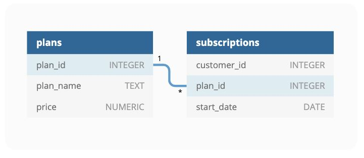

# SQL Challenge Week 3 Foodie-Fi

# Table of Contents
- [Introduction](#Introduction)
- [Entity Relationship Diagram](#Entity-Relationship-Diagram)
- [Business Questions and Solutions](https://github.com/Tori-Greg/Danny-Ma-SQL-Challenge_Foodie-fi/blob/main/Business%20Questions%20and%20Solutions.md)

## Introduction
Subscription based businesses are super popular and Danny realised that there was a large gap in the market - he wanted to create a new streaming service that only had food related content - something like Netflix but with only cooking shows!

Danny finds a few smart friends to launch his new startup Foodie-Fi in 2020 and started selling monthly and annual subscriptions, giving their customers unlimited on-demand access to exclusive food videos from around the world!

Danny created Foodie-Fi with a data driven mindset and wanted to ensure all future investment decisions and new features were decided using data. This case study focuses on using subscription style digital data to answer important business questions.

The aim of this analysis is to assist Danny in using subscription style digital data to answer required business questions

_For the full challenge kindly click [here](https://8weeksqlchallenge.com/case-study-3/)_

## Entity Relationship Diagram

**_The Entity Relationship diagram shows the relationships and connections between all tables in the database._**
